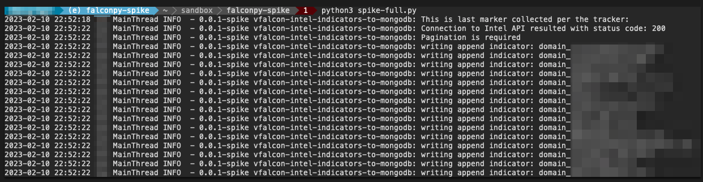

# Falcon Intel Spike

> **Warning**
> 
> This is Proof of Concept Code for fetching CrowdStrike Threat Intel Indicators in mass from the OAUTH2 REST API and storing them in a mongodb.
> 
> This proof of concept is a **concept**. This _is not a production ready_ tested piece of code that uses to best practices, patterns, and processes.

## Note

This is single threaded, and can take days to download the over 200+ Million indicators at 4000 indicators per page.

Storage of the solution would take 10s of GB of data and proper indexing on the MongoDB.

## Setup

Setup consist of using the `config.ini` and exporting sensitive OAUTH ENV variables as shown. Do not store your Client Secrets or Mongo Connection String secrets in a unprotected config file. 

Example of a connection string is in the config.ini:

`export MONGO_CONNECTIONSTRING=mongodb://[username:password@]host1[:port1][,...hostN[:portN]][/[defaultauthdb][?options]]`

## Dependencies

### FalconPy

Falconpy is the supported CrowdStrike Python Falcon SDK.

### MongoDB 

MongoClient is required to connect to a mongoDB with authorization via `mongoconnect string`
